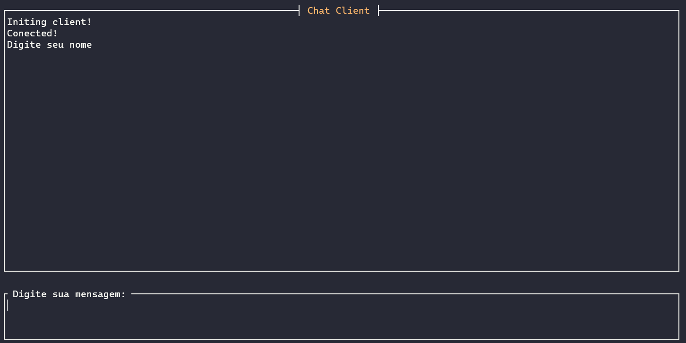

Ana Clara Amorim Andrade       NºUsp: 10691992

Fábio Dias da Cunha            NºUsp: 11320874

Lucas Gabriel de Araujo Silva  NºUsp: 11218880

Matheus Godoy Bolsarini        NºUsp: 9896201

# Chat-Socket

Chat implemented in C++, using ncurses and socket. Project made for class of Computer Networking.

## Dependencies

Needs ncurses library, for this use:

```bash
apt-get install ncurses-dev
```

_________________

## Usage

Run the makefile in the root of the project:

```bash
make all
```

To clean executables:

```bash
make clean
```

Will be genereted the `client` and `server` executable.

For local run, just run one time the server executable, and the client executable until reach the limit if you want. To do this type on the prompt after building:

```bash
./server
```


and

```bash
./client
```




## Concerns

The actual limit of concurrent clients are 10.
